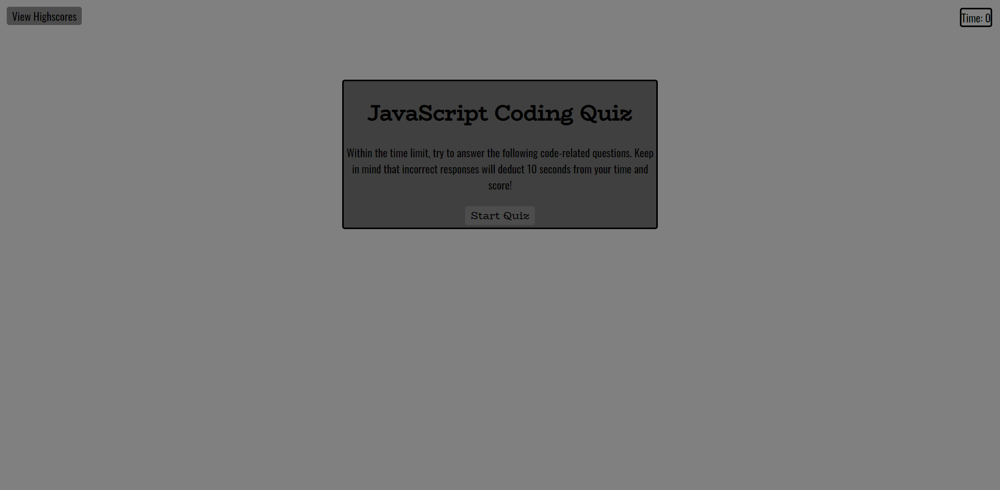

            __   ___   ___      ___         ___   __ __  ____  _____ 
           /  ] /   \ |   \    /  _]       /   \ |  |  ||    ||     |
          /  / |     ||    \  /  [_ _____ |     ||  |  | |  | |__/  |
         /  /  |  O  ||  D  ||    _]     ||  Q  ||  |  | |  | |   __|
        /   \_ |     ||     ||   [_|_____||     ||  :  | |  | |  /  |
        \     ||     ||     ||     |      |     ||     | |  | |     |
         \____| \___/ |_____||_____|       \__,_| \__,_||____||_____|
## Description
Web App which user is prompted multiple questions and has a time limit to answer them all. User then has the ability to save their high score, meaning they can come back at a later time and retry to get all questions answered and a better score.

Made from scratch mainly in JS, with minimal HTML & CSS.

## Usage & Screenshot
Deployed Web Application: [Code-Quiz](https://miguelmulet.github.io/Code-Quiz/)

Screenshot:

